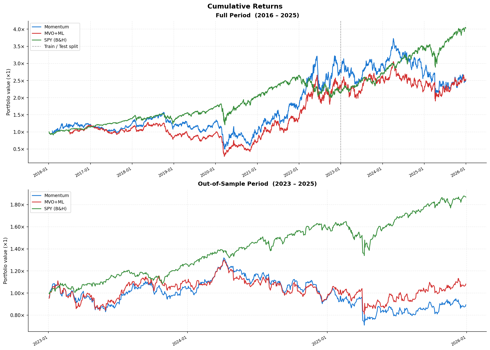
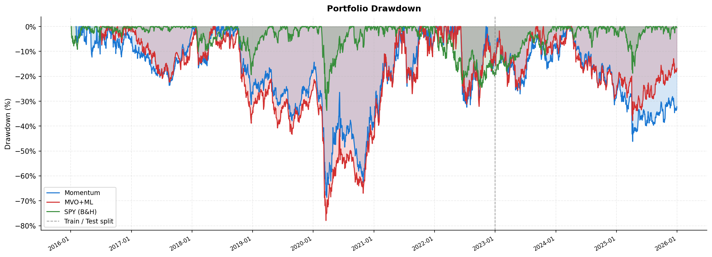
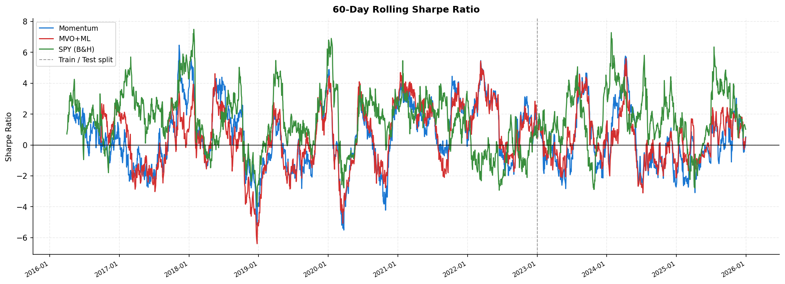

# AI Portfolio Comparison

A Python backtesting framework that pits two AI-driven portfolio strategies against a **SPY buy-and-hold benchmark** across S&P 500 Energy sector stocks (2016–2025). The project examines whether momentum replication and ML-enhanced mean-variance optimization can beat the market — and finds compelling evidence that they cannot, consistent with the Efficient Market Hypothesis.

---

## Strategies

| Strategy | Logic | Rebalance | Parameters |
|---|---|---|---|
| **Momentum** | Rank stocks by 20-day return; go long top 3 equally weighted | Weekly (every 5 days) | `N=20`, `top_n=3` |
| **MVO + ML** | Ridge Regression forecasts expected returns; plugged into MVO with covariance estimated over rolling 60-day window | Monthly (every 21 days) | `ridge_alpha=1.0`, `max_weight=0.25` |
| **SPY (B&H)** | Passive benchmark — buy and hold SPY | — | — |

**Universe:** S&P 500 Energy sector constituents  
**Training period:** Jan 2016 – Dec 2022  
**Out-of-sample period:** Jan 2023 – Dec 2025

---

## Pipeline

```
yfinance API
    │
    ▼
data/fetch_data.py          ← price data + fundamentals
    │
    ├──► models/momentum_strategy.py
    └──► models/mvo_ml_strategy.py
              │
              ▼
        backtest/engine.py  ← daily P&L simulation
              │
              ▼
      analysis/metrics.py   ← Sharpe, Sortino, Calmar, Alpha, Beta, MDD…
              │
              ▼
        main.py             ← orchestrates + outputs charts & CSV
```

---

## Results

### Cumulative Returns (2016–2025)



Both models outperformed SPY *in-sample* (2016–2022), with Momentum peaking at ~3.2× and MVO+ML reaching ~2.5× versus SPY's ~2.5×. **Out-of-sample (2023–2025), both significantly underperformed** — SPY compounded to ~1.85× while Momentum ended near breakeven (~0.9×) and MVO+ML stagnated at ~1.1×.

---

### Portfolio Drawdown



The COVID crash (Feb–Apr 2020) exposed severe tail risk in both models, with MVO+ML drawing down nearly **−78%** and Momentum hitting **−65%** — far worse than SPY's **−32%**. Out-of-sample, Momentum's 2025 drawdown of ~−45% further highlights regime fragility.

---

### 60-Day Rolling Sharpe Ratio



SPY's rolling Sharpe consistently tracks above both models out-of-sample. The two AI strategies show highly volatile risk-adjusted returns with extended sub-zero periods, while SPY maintains a more stable positive profile — particularly notable in the 2023–2025 window.

---

## Key Findings

- **In-sample overfitting:** Both models appeared competitive during training but failed to generalise. This is expected — Energy sector stocks exhibit high regime sensitivity and mean-reversion of momentum signals.
- **Transaction costs matter:** High-frequency rebalancing (especially the weekly momentum model) erodes returns in live conditions. This backtest assumes zero transaction costs.
- **Market efficiency holds:** The inability to beat a passive SPY strategy OOS is consistent with weak-form EMH. Alpha extracted in-sample is largely spurious.
- **MVO sensitivity:** Ridge Regression forecasts of expected returns are noisy; errors propagate into portfolio weights and amplify drawdowns relative to equal-weighting.

---

## Metrics Summary

Computed per strategy across three windows (Train / Test / Full):

| Metric | Description |
|---|---|
| Annualized Return | Geometric mean annual return |
| Annualized Volatility | Std dev of daily returns × √252 |
| Sharpe Ratio | Excess return per unit of total risk |
| Sortino Ratio | Excess return per unit of downside risk |
| Maximum Drawdown | Peak-to-trough decline |
| Calmar Ratio | Annualized return / Max drawdown |
| Beta | Sensitivity to SPY |
| Alpha (Annualized) | Jensen's alpha vs SPY |
| Win Rate | % of days with positive return |

Full metrics table is exported to `outputs/metrics_table.csv` on each run.

---

## Repository Structure

```
AI-Portfolio-Comparison/
├── main.py                  # Orchestrates full pipeline
├── requirements.txt
├── data/
│   └── fetch_data.py        # Downloads prices + fundamentals via yfinance
├── models/
│   ├── momentum_strategy.py # Cross-sectional momentum weights
│   └── mvo_ml_strategy.py   # Ridge Regression + MVO weights
├── backtest/
│   └── engine.py            # Simulates daily P&L from weight signals
├── analysis/
│   └── metrics.py           # Risk/return metric calculations
└── outputs/                 # Auto-generated on run
    ├── cumulative_returns.png
    ├── drawdown.png
    ├── rolling_sharpe.png
    └── metrics_table.csv
```

---

## Installation & Usage

```bash
# 1. Clone
git clone https://github.com/K0ian/AI-Portfolio-Comparison.git
cd AI-Portfolio-Comparison

# 2. Install dependencies
pip install -r requirements.txt

# 3. Run
python main.py
```

All outputs are written to `outputs/`. No API keys required — data is pulled via `yfinance`.

**Dependencies:** `yfinance` · `pandas` · `numpy` · `scipy` · `scikit-learn` · `matplotlib` · `seaborn`

---

## Context

This project was developed as part of a research paper for a Money, Banking & Financial Markets course, comparing AI-driven portfolio construction against passive benchmarks. The out-of-sample underperformance was the central finding, interpreted through a market efficiency lens.
